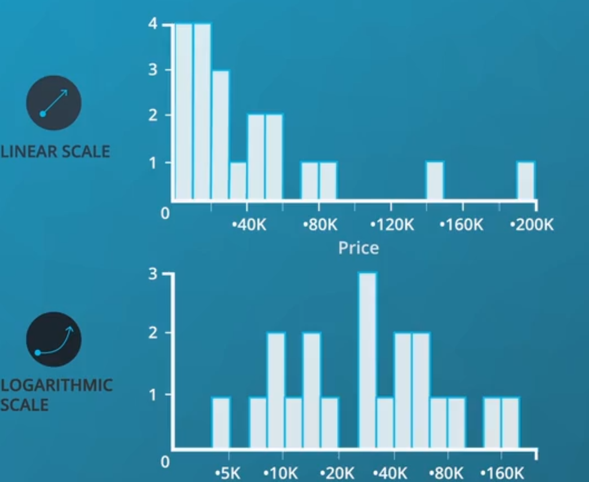

Course Structure
As this course covers a broad range of ways that data visualizations can be used in the data analysis process, there will also be a large number of topics that will be touched upon. Below is a summary of topics that will be covered in the remaining lessons in this course.

---

# Lesson 2: Design of Visualizations
Before getting into the actual creation of visualizations later in the course, this lesson introduces design principles that will be useful both in exploratory and explanatory analysis. You will learn about different data types and ways of encoding data. You will also learn about properties of visualizations that can impact both the clarity of messaging as well as their accuracy.
## Notes

### Visuals can be bad if they:
- Don't convey the desired message.
- Are misleading.

This seems straightforward, but often visuals are created that do one or both of these unintentionally. There is an entire book that was published aimed at misleading visuals: How to Lie with Statistics.

### The Four Levels of Measurement
In order to choose an appropriate plot type or method of analysis for your data, you need to understand the types of data you have. One common method divides the data into four levels of measurement:

1. **Qualitative or categorica**l types (non-numeric types)
   1. **Nominal** data: pure labels without inherent order (no label is intrinsically greater or less than any other)
   2. **Ordinal** data: labels with an intrinsic order or ranking (comparison operations can be made between values, but the magnitude of differences are not be well-defined)
2. **Quantitative or numeric types**
   1. **Interval** data: numeric values where absolute differences are meaningful (addition and subtraction operations can be made)
   2. **Ratio** data: numeric values where relative differences are meaningful (multiplication and division operations can be made)


All **quantitative**-type variables also come in one of two varieties: **discrete and continuous.**

- **Discrete** quantitative variables can only take on a **specific set value**s at some maximum level of precision.
- **Continuous** quantitative variables can (hypothetically) take on values to **any level of precision.**

Distinguishing between continuous and discrete can be a little tricky – a rule of thumb is if there are few levels, and values can't be subdivided into further units, then it's discrete. Otherwise, it's continuous. If you have a scale that can only take natural number values between 1 and 5, that's discrete. A quantity that can be measured to two digits, e.g. 2.72, is best characterized as continuous, since we might hypothetically be able to measure to even more digits, e.g. 2.718. A tricky case like test scores measured between 0 and 100 can only be divided down to single integers, making it initially seem discrete. But since there are so many values, such a feature is usually considered as continuous.

When exploring your data, the most important thing to consider first is whether your data is qualitative or quantitative. In later lessons, you will see how this distinction impacts your choice of plots.

###Visual Encodings

### Examples of chart junk you saw in this video include:
1. Heavy grid lines
2. Unnecessary text
3. Pictures surrounding the visual
4. Shading or 3d components
5. Ornamented chart axes

[More on wiki](https://video.udacity-data.com/topher/2019/November/5dcc693a_chartjunk-wikipedia/chartjunk-wikipedia.pdf)

###data-ink ratio
the higher the bettter

###Design Integrity Notes
One of the main ways discussed here for looking at data integrity was with the lie factor. Lie factor depicts the degree to which a visualization distorts or misrepresents the data values being plotted. It is calculated in the following way:

Flowing Data: [How to Spot Visualization Lies](https://flowingdata.com/2017/02/09/how-to-spot-visualization-lies/)
[More PDFs](https://video.udacity-data.com/topher/2019/November/5dc4a59c_how-to-spot-visualization-lies-flowingdata/how-to-spot-visualization-lies-flowingdata.pdf)

###Using Color

Color can both help and hurt a data visualization. Three tips for using color effectively.

1. Before adding color to a visualization, start with black and white.
2. When using color, use** less intense** colors - not all the colors of the rainbow, which is the default in many software applications.
3. Color for communication. Use color to **highlight** your message and separate groups of interest. Don't add color just to have color in your visualization.
4. Try to use Blue and orange instead of Red and green colors

###Shape, Size, & Other Tools
In general, **color** and **shape** are best for categorical variables, while the **size** of marker can assist in adding additional **quantitative** **data**, as we demonstrated here.

Instead, it might be better to **break the information** into multiple **individual messages**, so the audience can understand every aspect of your message.

---

# Lessons 3-5: Exploration of Data
These lessons systematically present core visualizations in exploratory data analysis. Exploration starts with univariate visualizations to identify trends in distribution and outliers in single variables. Bivariate visualizations follow, to show relationships between variables in the data. Finally, multivariate visualization techniques are presented to identify complex relationships between three or more variables at the same time.

### What is Tidy Data?
is a tabular dataset where:

- each variable is a column
- each observation is a row
- each type of observational unit is a table

[more](https://classroom.udacity.com/nanodegrees/nd002-mena-nfp3/parts/211104e3-a5bc-4247-87b7-06bfa757806c/modules/884648ee-be0a-4bde-853f-26e97458edc8/lessons/b86503df-e416-4f0e-9e2d-a7a3c08d0bc3/concepts/f65e11a1-e5f5-4cb2-be57-5db700af0e7a)


#03.Univariate Exploration of Data Videos
we look here how each variable is distributed before moving on new complex drawing

## barchart and Histogram

In categorical variables the most commen chart is the bar chart
X > cat
Y > freqency

### pipe line

1. colors

```py
base_color = sb.color_palette()[0]
```
2. order the data if it's not Ordinal types

```py
order = df['column'].value_counts().index
```
3. draw what u need

```py
sb.countplot(data = df, x = 'column', color = base_color, order = order);
```

4. add rotation if needed
```py
sb.countplot(data = df, x = c, color = base_color, order = order);
plt.xticks(rotation = r);
```
5. make Horiznotal  barchart

just **make the X into Y**
```py
sb.countplot(data = df, y = c, color = base_color, order = order);
plt.xticks(rotation = r);
```

### full function to do that

```py
def orderedhisto(df,c, r_x = 0 , h = 0 , r_y = 0):
    #must be there
    base_color = sb.color_palette()[0]
    c = str(c)


    #order
    order = df[c].value_counts().index

    #normal plot
    if h == 1:
        sb.countplot(data = df, y = c, color = base_color, order = order);
    else:
        sb.countplot(data = df, x = c, color = base_color, order = order);
    plt.xticks(rotation = r_x);
    plt.yticks(rotation = r_y);
```

```py
orderedhisto(pk,"type_1", in_y = True)
```

6. relative Values

```py
def relative_Values(df, c ,step = 0, orginaldf = 0 , r_x = 0 , h = 0 , r_y = 0):
    c = str(c)
    base_color = sb.color_palette()[0]

    #prepare for the relative
    if step >0:
        try:
            n_points = originaldf.shape[0]
        except:
            n_points = df.shape[0]
        max_count =  df[c].value_counts()[0]
        max_prop = max_count / n_points
        # generate tick mark locations and names
        tick_props = np.arange(0, max_prop, step)
        tick_names = ['{:0.2f}'.format(v) for v in tick_props]
    else:
        pass

    #order
    order = df[c].value_counts().index

    #normal plot
    if h == 1:
        sb.countplot(data = df, y = c, color = base_color, order = order);
    else:
        sb.countplot(data = df, x = c, color = base_color, order = order);
    plt.xticks(rotation = r_x);
    plt.yticks(rotation = r_y);

    #addons for the relative
    if step >0:
        plt.xticks(tick_props * n_points, tick_names);
        plt.xlabel('proportion');
    else:
        pass
```

more to it

```py
def univar_bar(df, c ,prop = 0 , relative = 0, orginaldf = 0 , r_x = 0 , h = 0 , r_y = 0):
    #req steps
    c = str(c)
    base_color = sb.color_palette()[0]

    #prepare for the relative
    try:
        n_points = originaldf.shape[0]
    except:
        n_points = df.shape[0]
    #do relative
    if relative == 1:         
        max_count =  df[c].value_counts()[0]
        max_prop = max_count / n_points
        # generate tick mark locations and names
        tick_props = np.arange(0, max_prop, .02)
        tick_names = ['{:0.2f}'.format(v) for v in tick_props]
    else:
        pass

    #count and order

    count = df[c].value_counts()
    order = df[c].value_counts().index

    #add proportion
    if prop == 1:
        for i in range(count.shape[0]):
            counts = count[i]
            pct_string = '{:0.1f}%'.format(100*counts/n_points)
            plt.text(counts+1 , i,  pct_string , va = 'center');    
    else:
        pass


    #normal plot
    if h == 1:
        sb.countplot(data = df, y = c, color = base_color, order = order);
    else:
        sb.countplot(data = df, x = c, color = base_color, order = order);
    plt.xticks(rotation = r_x);
    plt.yticks(rotation = r_y);

    #addons for the relative
    if relative == 1:
        plt.xticks(tick_props * n_points, tick_names);
        plt.xlabel('proportion');
    else:
        pass
```

###  count NA and plot them

```py
def countna(df,r_x = 0 , h = 0 , r_y = 0):
    na_counts = pk.isna().sum()
    na_counts.sort_values(ascending= False, inplace = True)
    base_color = sb.color_palette()[0]
    if h == 1:
        sb.barplot(y = na_counts.index.values, x = na_counts, color = base_color)
    else:
        sb.barplot(x = na_counts.index.values, y = na_counts, color = base_color)
    plt.xticks(rotation = r_x);
    plt.yticks(rotation = r_y);
```
### Pie Charts
A pie chart is a common univariate plot type that is used to depict relative frequencies for levels of a categorical variable. Frequencies in a pie chart are depicted as wedges drawn on a circle: the larger the angle or area, the more common the categorical value taken.

- Make sure that your interest is in relative frequencies. Areas should represent parts of a whole, rather than measurements on a second variable (unless that second variable can logically be summed up into some whole).
- Limit the number of slices plotted. A pie chart works best with two or three slices, though it's also possible to plot with four or five slices as long as the wedge sizes can be distinguished. If you have a lot of categories, or categories that have small proportional representation, consider grouping them together so that fewer wedges are plotted, or use an 'Other' category to handle them.
- Plot the data systematically. One typical method of plotting a pie chart is to start from the top of the circle, then plot each categorical level clockwise from most frequent to least frequent. If you have three categories and are interested in the comparison of two of them, a common plotting method is to place the two categories of interest on either side of the 12 o'clock direction, with the third category filling in the remaining space at the bottom.

```py
def piechart(df,c ,donat = 1 ):
    sorted_counts = df[c].value_counts()
    plt.pie(sorted_counts, labels = sorted_counts.index, startangle = 90,
        counterclock = False, wedgeprops = {'width' : donat});
    plt.axis('square')
```
donat from 0 - 1

### Histograms
A histogram is used to plot the **distribution** of a **numeric** **variable**. It's the quantitative version of the bar chart.
However, rather than plot **one** **bar** for each **unique** numeric value, values are **grouped** into continuous **bins**, and one bar for each bin is plotted depicting the number. For instance, using the default settings for matplotlib's hist function:

```py
plt.hist(data = df, x = 'num_var')
```

there is some tips of how to use bins [here][aa81fea5]

but it's looks like i am better of trying my self
```py
def histogram(df, c , step = 0 , bins = 0 ):
    if step > 0:
        bins = np.arange(df[c].min()-step, df[c].max()+step , step);
        plt.hist(data = df, x = c, bins = bins);
        plt.title(label = (c + ' With bin each ' + str(step)) )
    else:
        plt.hist(data = df, x = c, bins = bins);
        plt.title(label = (c + ' With bin method= ' + bins) )

def histtest(df, c):
    v = ['auto', 'fd', 'doane', 'scott', 'stone', 'rice', 'sturges', 'sqrt' , 10 , 50]
    i = 1
    plt.figure(figsize = [15, 25])
    for b in v:
        #print(b)
        plt.subplot(5, 2, i) # 1 row, 2 cols, subplot 1
        plt.hist(data = pk, x = 'speed', bins = b);
        plt.title(b)
        i += 1
```

## More on plots and subplot

[Here](https://classroom.udacity.com/nanodegrees/nd002-mena-nfp3/parts/211104e3-a5bc-4247-87b7-06bfa757806c/modules/884648ee-be0a-4bde-853f-26e97458edc8/lessons/b86503df-e416-4f0e-9e2d-a7a3c08d0bc3/concepts/83335e78-7d71-423b-84a9-f47cdf64c0f9)

At this point, you've seen and had some practice with some basic plotting functions using matplotlib and seaborn.

The previous page introduced something a little bit new: creating two side-by-side plots through the use of matplotlib's [subplot()](https://matplotlib.org/api/_as_gen/matplotlib.pyplot.subplot.html) function.
If you have any questions about how that or the [figure()](https://matplotlib.org/api/_as_gen/matplotlib.pyplot.figure.html) function worked, then read on.

This page will discuss the basic structure of visualizations using matplotlib and how subplots work in that structure.

The base of a visualization in matplotlib is a **Figure object**.

Contained within each **Figure** will be **one or more Axes objects**,

each **Axes object** containing a number of other **elements** that represent each plot.

In the earliest examples, these objects have been created **implicitly**. Let's say that the following expression is run inside a Jupyter notebook to create a histogram:
```py
plt.hist(data = df, x = 'num_var')
```
Since we don't have a **Figure area** to plot inside, Python first creates a **Figure object**.

And since the Figure **doesn't start with any Axes** to draw the histogram onto, an Axes object is created **inside the Figure**. Finally, the histogram is drawn within that Axes.


One **alternative** way we could have created the histogram is to **explicitly** set up the **Figure** and **Axes** like this:
```py
fig = plt.figure()
ax = fig.add_axes([.125, .125, .775, .755])
ax.hist(data = df, x = 'num_var')
```
figure() creates a new Figure object, a reference to which has been stored in the variable fig.

One of the Figure **methods** is .add_axes(), which creates a new Axes object in the Figure.

The method requires one list as argument specifying the **dimensions** of the Axes:
the **first two** elements of the list indicate the **position of the lower-left hand corner** of the Axes (in this case one quarter of the way from the lower-left corner of the Figure) and

the **last two** elements specifying the Axes **width and height**, respectively. We refer to the Axes in the variable **ax**. Finally, we use the Axes method **.hist()** just like we did before with **plt.hist().**
```py
fig = plt.figure()
ax = fig.add_axes([.125, .125, .775, .755])
base_color = sb.color_palette()[0]
sb.countplot(data = df, x = 'cat_var', color = base_color, ax = ax)
```

## subplot

```py
plt.figure(figsize = [10, 5]) # larger figure size for subplots

# example of somewhat too-large bin size
plt.subplot(1, 2, 1) # 1 row, 2 cols, subplot 1
bins = np.arange(0, pk['speed'].max()+5 , 5);
plt.hist(data = pk, x = 'speed', bins = bins);

# example of somewhat too-small bin size
plt.subplot(1, 2, 2) # 1 row, 2 cols, subplot 2
bins = np.arange(0, pk['speed'].max()+1 , 1);
plt.hist(data = pk, x = 'speed', bins = bins);

```

### Choosing a Plot for Discrete Data
 see what happens when changhe the rwidth
it make some area to see the steps

```py
die_rolls = np.random.randint(2,13,100)

plt.figure(figsize=(15,5))
plt.subplot(1,3,1)
bin_edges = np.arange(1.5, 12.5+1, 1)
plt.hist(die_rolls, bins = bin_edges, rwidth = .7)
plt.xticks(np.arange(2, 12+1, 1));
plt.subplot(1,3,2)
bin_edges = np.arange(1.5, 12.5+1, 1)
plt.hist(die_rolls, bins = bin_edges, rwidth = 1)
plt.xticks(np.arange(2, 12+1, 1));
plt.subplot(1,3,3)
bin_edges = np.arange(1.5, 12.5+1, 1)
plt.hist(die_rolls, bins = bin_edges, rwidth = .2)
plt.xticks(np.arange(2, 12+1, 1));
```

### Descriptive Statistics,
we use plots to tells us some immedtly info like the skew of the data the distribution and so on

and also we can see if there is an outlier to deal with or further investiges

### Outliers and Axis Limits

used

```py
plt.xlim((0,value));
```
### scale

the standard assumption is that your data should be represented **linearly**

in other cases we might interested in terms like **Ratio** and **precentages**

EX: dealing with finance



#### Scales and Transformations
Certain data distributions will find themselves amenable to scale transformations. The most common example of this is data that follows an approximately **log-normal distribution**. This is data that, in their **natural units**, can look highly skewed: lots of points with low values, with a very long tail of data points with large values. However, after applying a **logarithmic** transform to the data, the data will follow a **normal distribution**. (If you need a refresher on the logarithm function, check out this lesson on Khan Academy.)

final best code with good bins and good names for the bins will be

```py
def logscaller(df,c,step):
    maxs = np.log10(df[c].describe()).max()
    mins = np.log10(pk[c].describe()).min()
    bins = 10 ** np.arange(mins, maxs+step , step);
    ticks = [.1,.3, 1,3, 10,30, 100,300, 1000]
    labels = ['{}'.format(i) for i in ticks]
    plt.hist(data = df, x = c, bins = bins);
    plt.xscale('log');
    plt.xlabel(xlabel = (c + ' in log scale'));
    plt.xticks(ticks, labels);
```

Also there is sqrt scaller

```py
def sqrtscaller(df,c,step):
    def sqrt_trans(x, inverse = False):
        """ transformation helper function """
        if not inverse:
            return np.sqrt(x)
        else:
            return x ** 2
    data = df[c]
    bin_edges = np.arange(sqrt_trans(data.min())-step, sqrt_trans(data.max())+step, step)
    plt.hist(data.apply(sqrt_trans), bins = bin_edges);
    tick_locs = np.arange(0, sqrt_trans(data.max())+(step *10), (step *10))
    plt.xticks(tick_locs, sqrt_trans(tick_locs, inverse = True).astype(int))
```


# Lesson 6: Explanatory Visualizations
This lesson describes considerations that should be made when moving from exploratory data analysis to explanatory analysis. When polishing visualizations to present to others, you will need to consider what findings you want to focus on and how to use visualization techniques to highlight your main story. This lesson also provides tips for presentation of results and how to iterate on your presentations.

# Lesson 7: Visualization Case Study
In this lesson, you will bring together everything from the previous lessons in an example case study. You will be presented with a dataset and perform an exploratory analysis. You will then take findings from that analysis and polish them up for presentation as explanatory visualizations.
